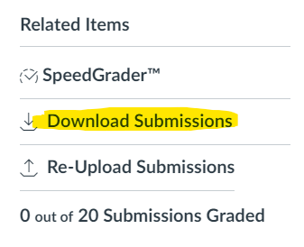
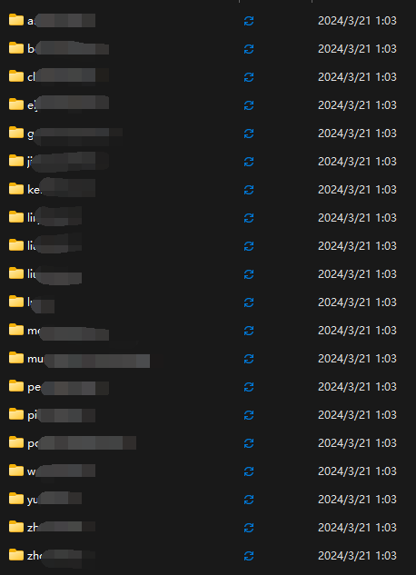

# How to use this tool?

1. Download the submissions file from Canvas.

    

2. Drag the `submission.zip` into `organize.py`. Follow the prompt to unzip students' submissions into organized folders. Please be careful of the working directory of the scripts. Directories will be created under the same work directory of the scripts.

    The directory (named when running `organize.py`) will look like this: 

    

    Each folder is the submission of a student.

3. Evaluating Homeworks:

    * For C++ Homeworks, drag the organized Homework Submission Folder into `evaluate_cpp.py`. The program will iterate through the students, and compile their source codes into an executable file of the same name.

    * For xv6 Homeworks, drag the orgnized Homework Submission Folder into `evaluate_xv6.py`. The program will create a xv6 environment for each of the students. Then it will start the qemu-nox emulator on each student.

# Note
The scripts I developed are very primitive and can be buggy sometimes, also, the environments of C++/xv6 are not included. 

Therefore, it is mandatory that the scripts are executed inside a Linux Environment with C++ and xv6 pre-installed.

# Future Suggestions
1. `evaluate_cpp.py` only compiles the source code files. You can try to implement subprocesses that runs the executables and maybe examine the outputs automatically.